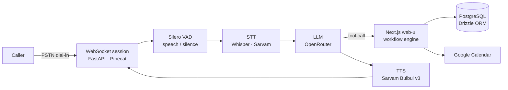

<h1 align="center">Shreyas</h1>

  

  <strong>Software Engineer</strong>, building end-to-end web platforms, APIs, and the deployment in between.

  4+ years at the intersection of tech and business: clean code, business thinking, and user experience in the same room.

  <a href="https://shreyas.thegoweb.com">Blog</a> ·
  <a href="https://www.linkedin.com/in/shreyasmark1">LinkedIn</a> ·
  <a href="https://github.com/Shreyasmark1">GitHub</a> ·
  <a href="mailto:shreyas@thegoweb.com">Email</a>

---

<strong>Full-Stack Engineer</strong> 
Based in Mangalore, India 
Ships TypeScript &#183; Java &#183; Python 
Learning Go &#183; Docker &#183; agent infrastructure

 

## Stats

 

## Stack

<strong>Frontend</strong>  

<strong>Backend</strong>  

<strong>Databases</strong>  

<strong>Cloud &amp; Infrastructure</strong>  

<strong>Platforms</strong>  

<strong>Tooling</strong>  

 

## Learning

Active ground, not box-ticking. These are the things I'm working through right now.

| Area | What |
|---|---|
| **Languages** | Go, Python |
| **AI frameworks** | LangChain, LangGraph |
| **Voice** | Pipecat, STT/TTS pipelines, voice activity detection |
| **Retrieval** | RAG, vector databases |

 

## Featured Build: Missed-Call Voice Agent

Small businesses lose calls when nobody picks up. This answers them.

A caller dials a shop, clinic, delivery service or repair service. The agent picks up, holds a natural conversation in **English or Hindi**, collects the details the business actually cares about (order, appointment, lead, service request), books a calendar slot when the caller confirms a time, and leaves a structured record behind.

Two cooperating services in one repo:

| Service | Responsibility | Stack |
|---|---|---|
| `web-ui/` | Owner-facing app: auth, business and workflow builder, Google Calendar connect, chat and voice agent simulators, records dashboard. Also exposes the HTTP endpoints the voice agent calls back into. | Next.js 16, React 19, TypeScript, Drizzle ORM + PostgreSQL, NextAuth, Vercel AI SDK |
| `voice-agent/` | Real-time audio: holds the WebSocket call, runs STT to LLM to TTS, and executes business tools by calling back into `web-ui`. | Python, FastAPI, Pipecat, Silero VAD, Sarvam STT/TTS |

**Architecture decisions**

- **The voice process holds no business data and no database credentials.** Every side effect leaves the process: tools are thin async wrappers that POST to `web-ui` and return its response. `web-ui` owns auth, the workflow engine and PostgreSQL, so there is one place where business rules live and one place to audit who did what.
- **Tool availability is a capability list, not a hardcoded set.** `web-ui` sends the tools a given business has enabled, and `get_tools()` registers only those. Adding a workflow type does not mean redeploying the agent.
- **The LLM is bound to `OpenAILLMService` with a configurable `base_url`, not to a vendor SDK.** Any OpenAI-compatible endpoint works, which is why the default model sits on OpenRouter. Swapping providers is a base URL and a model string, not a code change.
- **Barge-in is handled at the aggregator, not the transport.** `SileroVADAnalyzer` is passed into `LLMUserAggregatorParams`, so silence is detected where turn boundaries are actually decided. `vad_signals` and `high_vad_sensitivity` on the STT side complement it with a second, independent silence signal.
- **Frames are protobuf, not JSON.** `ProtobufFrameSerializer` keeps every hop on the hot audio path binary, including the client leg.
- **Contracts live in the tool docstrings.** The calendar tools document their ordering rules in the schema itself ("check availability BEFORE proposing a booking time", "only call this after the caller picks an available slot"). The model gets the invariant as part of the tool definition, so it is enforced by the interface rather than by prompt discipline.
- **Failing early is cheaper than failing mid-call.** `pydantic-settings` validates provider/model combinations and cross-field requirements at import, and Compose marks only the genuinely required secrets with `${VAR:?...}`. Everything else has a working default, so a misconfigured provider fails at boot instead of dropping a caller mid-conversation.
- **`ProcessorUnusablePolicy.END` over silent continuation.** If a processor dies mid-pipeline the worker ends the call cleanly instead of leaving the caller on a dead line.
- **Bilingual is locale-driven, not prompt-driven.** An 11-entry map of Indian language codes feeds Pipecat's `Language` enum into STT, TTS and the session together, so the three always agree. Unmapped input falls back to `en-IN`.

 

## The Journey

The stack, year by year.

| Year | Focus |
|------|-------|
| **2022** | Java and Spring Boot, JWT, MySQL. Flutter and Angular alongside. |
| **2023** | React and Express. |
| **2024** | Next.js, React Native, PWA, and Go. |
| **2025** | Clean architecture. NestJS, PostgreSQL, Docker, AWS. |
| **2026** | Python and AI. Voice agents, multi-model AI, LangChain, LangGraph, vector databases, tool calling, Pipecat, FastAPI. |

 

## Writing

- [The Illusion of "Business Context" in AI Product Scoping](https://shreyas.thegoweb.com), July 2026
- More at [shreyas.thegoweb.com](https://shreyas.thegoweb.com)

 

## Currently

- Shipping the voice agent platform into real small-business deployments
- Learning Go, drawn to it by wanting backend fluency beyond the JVM
- Getting properly serious with Docker, Terraform and Dokploy
- Working through LangChain, LangGraph and RAG for retrieval-heavy agent work
- Exploring the shift from writing code to orchestrating agents that do the heavy lifting

 

## Let's Connect

**Website** · [shreyas.thegoweb.com](https://shreyas.thegoweb.com)
**LinkedIn** · [linkedin.com/in/shreyasmark1](https://www.linkedin.com/in/shreyasmark1)
**Email** · [shreyas@thegoweb.com](mailto:shreyas@thegoweb.com)

 

